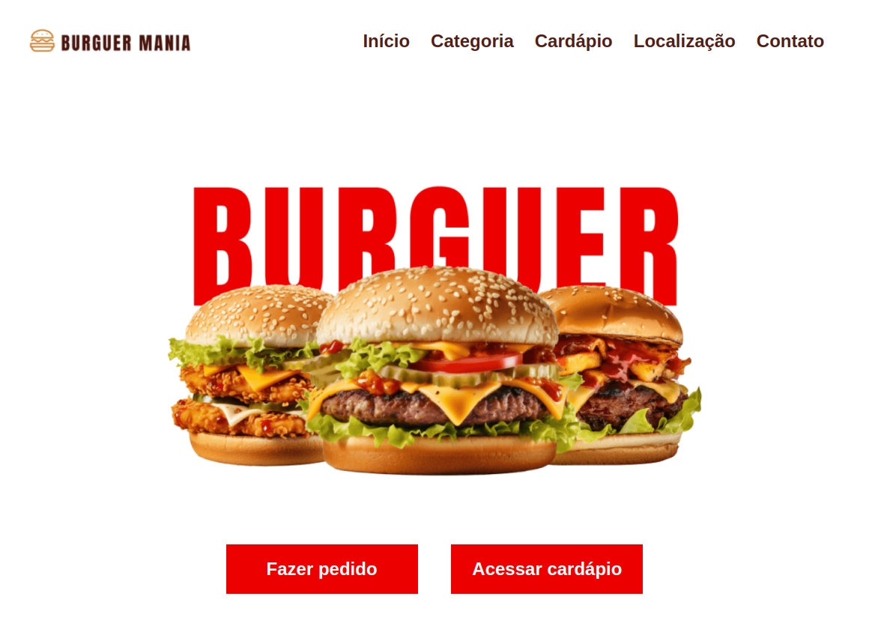

<div align="center">
    <a href="https://github.com/kaikbomfim/BurguerMania" target="_blank">
        
    </a>
</div>

<div align="center">
   
</div>

<h2 align="center">Experimente o sabor irresistível da perfeição, com hambúrgueres artesanais que conquistam corações e paladares.</h2>

## **Visão Geral**

**BurguerMania** é uma aplicação web projetada para apresentar o cardápio completo de hambúrgueres artesanais oferecidos pela hamburgueria. Desenvolvida com Angular, a aplicação é **responsiva**, **prática** e foca em proporcionar uma experiência agradável para seus usuários.

Os dados exibidos são fornecidos por uma **API fictícia**, que resgata informações detalhadas sobre cada hambúrguer.

## Deploy da Aplicação

Confira à BurguerMania acessando o link a seguir: [BurguerMania](https://burguermania-ten.vercel.app/).

## **Instruções de Uso**

Para rodar o **BurguerMania** localmente, siga os passos abaixo:

1. Clone este repositório:

   ```bash
   git clone https://github.com/kaikbomfim/BurguerMania.git
   ```

2. Acesse o diretório do projeto:

   ```bash
   cd ./BurguerMania
   ```

3. Instale as dependências do projeto:

   ```bash
   npm install
   ```

4. Inicie o servidor local:

   ```bash
   npm start
   ```

5. Acesse a aplicação no navegador em: http://localhost:4200.

## Tecnologias Utilizadas

- **Front-end:** Angular, HTML5, CSS3 e TypeScript.
- **APIs:** Json-server (simula uma API fictícia para informações dos hambúrgueres).
- **Ambiente de execução:** Node.js (utilizado durante o desenvolvimento para gerenciar dependências).
- **Controle de versão:** Git e GitHub.

## Possíveis Melhorias

**Melhorias Técnicas**

- Utilizar uma API real para fornecer informações detalhadas de hambúrgueres e cardápios.
- Implementar um sistema de login e autenticação para clientes.

**Expansões de Funcionalidades**

- Implementar demais seções na aplicação, como: localização e contato.
- Criar uma seção de pedidos online, com integração para pagamento digital.
- Adicionar uma calculadora de calorias para hambúrgueres customizados.
